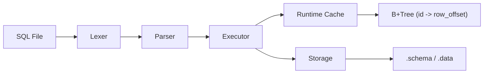

# B+Tree SQL Engine

## 개요

이 프로젝트는 기존 파일 기반 SQL 처리기 위에 `id -> row_offset` 메모리 기반 B+Tree 인덱스를 얹은 미니 SQL 엔진이다.

기존 파이프라인은 유지한다.

- `Lexer -> Parser -> Executor -> Storage`
- 저장 포맷은 `<table>.schema`, `<table>.data`
- `WHERE`는 단일 `column = literal`
- 출력 형식은 기존과 동일

추가된 핵심 기능은 다음과 같다.

- `id` 컬럼이 있는 테이블은 `INSERT` 시 `id`를 자동 생성한다.
- `id` 컬럼이 있는 테이블은 첫 접근 시 `.data` 파일을 스캔해 B+Tree 인덱스를 1회 빌드한다.
- `SELECT ... WHERE id = ?` 중 canonical positive integer literal인 경우에만 B+Tree를 사용한다.
- 다른 컬럼 조건 조회는 기존처럼 선형 탐색을 수행한다.

## 아키텍처



### Runtime Cache

한 실행 안에서 같은 테이블을 여러 번 다룰 수 있으므로, statement마다 `.data`를 다시 스캔하지 않기 위해 `ExecutionContext`를 둔다.

- `ExecutionContext`
  - `db_dir`
  - 테이블별 `TableRuntime` 배열
- `TableRuntime`
  - schema 캐시
  - `id` 컬럼 존재 여부
  - `next_id`
  - `BPTree id_index`

## 저장 구조

### Schema

`users.schema`

```text
id
name
age
```

### Data

`users.data`

```text
1|Alice|20
2|Bob|25
```

### Escape 규칙

- `\\` : 백슬래시
- `\|` : 실제 `|`
- `\n` : 줄바꿈

### 인덱스 값

B+Tree leaf value는 row 전체가 아니라 `.data` 파일의 `row_offset`이다.

- key: `uint64_t id`
- value: `long row_offset`

이 덕분에 `WHERE id = ?`는 전체 파일을 다시 읽지 않고, 인덱스로 offset을 찾은 뒤 그 row 한 줄만 바로 읽을 수 있다.

## id 자동 생성 규칙

- indexed table의 기준: schema에 정확히 `id` 컬럼이 있으면 indexed table
- 빈 테이블이면 `id`는 `1`부터 시작
- 기존 row가 있으면 `next_id = max(existing_id) + 1`
- 기존 `.data`의 `id`는 canonical positive integer만 허용한다
- malformed / duplicate / empty id가 있으면 index build는 실패한다

### 허용되는 INSERT

schema:

```text
id
name
age
```

허용:

```sql
INSERT INTO users VALUES ('Alice', 20);
INSERT INTO users (age, name) VALUES (21, 'Bob');
```

실제 저장:

```text
1|Alice|20
2|Bob|21
```

금지:

```sql
INSERT INTO users (id, name) VALUES (7, 'Alice');
```

## 인덱스 사용 조건

다음 조건을 모두 만족할 때만 B+Tree를 사용한다.

1. 테이블에 `id` 컬럼이 있어야 한다.
2. `WHERE`가 있어야 한다.
3. `WHERE` 컬럼이 정확히 `id`여야 한다.
4. literal이 canonical positive integer여야 한다.

예시:

- `WHERE id = 123` -> index 사용
- `WHERE id = '123'` -> index 사용
- `WHERE id = '00123'` -> index 사용 안 함
- `WHERE id = 1.0` -> index 사용 안 함
- `WHERE name = 'Alice'` -> index 사용 안 함

index 사용 여부는 `ExecResult.used_index`로 검증한다.

## 복잡도

- indexed select: 대략 `O(log N)` + single-row read
- non-index select: `O(N)`

## 빌드와 테스트

```sh
make
make test
```

기본 실행:

```sh
./sql_processor -d ./db -f ./queries/insert_users.sql
./sql_processor -d ./db -f ./queries/select_users.sql
./sql_processor -d ./db -f ./queries/select_user_where.sql
```

## 벤치마크

벤치마크 바이너리:

```sh
make
./build/benchmark_bptree -d ./build/benchmark_db -t users -n 1000000 -p 100
```

출력 예시:

```text
Rows inserted: 1000000
Insert total: 8421.53 ms
ID select avg: 0.08 ms
Name select avg: 57.31 ms
Speedup: 716.37x
```

## 테스트 구성

- `tests/test_lexer.c`
- `tests/test_parser.c`
- `tests/test_storage.c`
- `tests/test_bptree.c`
- `tests/test_runtime_index.c`
- `tests/test_executor.c`
- `tests/test_integration.sh`

## 한계점

- 인덱스는 메모리 기반이며 디스크에 영속화되지 않는다.
- 프로세스 시작 후 첫 테이블 접근 시 `.data`를 스캔해서 rebuild한다.
- `WHERE`는 여전히 단일 equality만 지원한다.
- `UPDATE`, `DELETE`, `JOIN`, range scan은 아직 없다.
