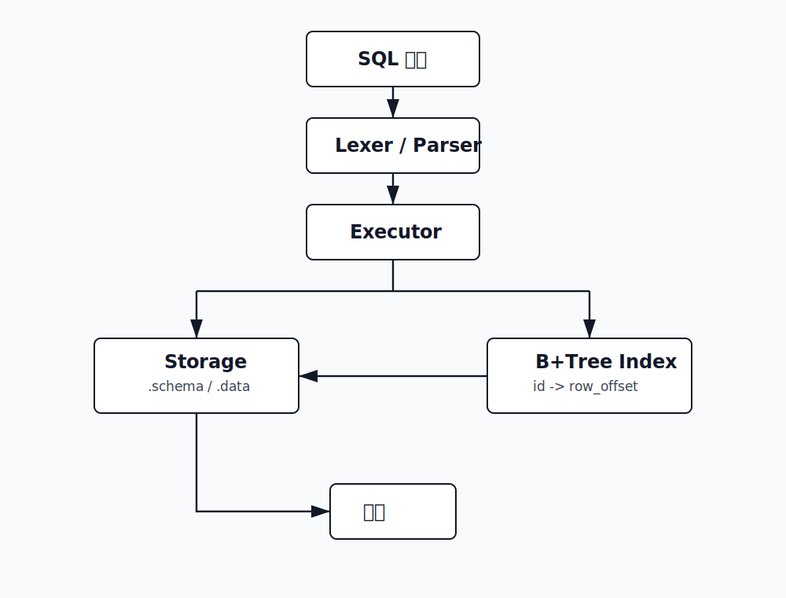
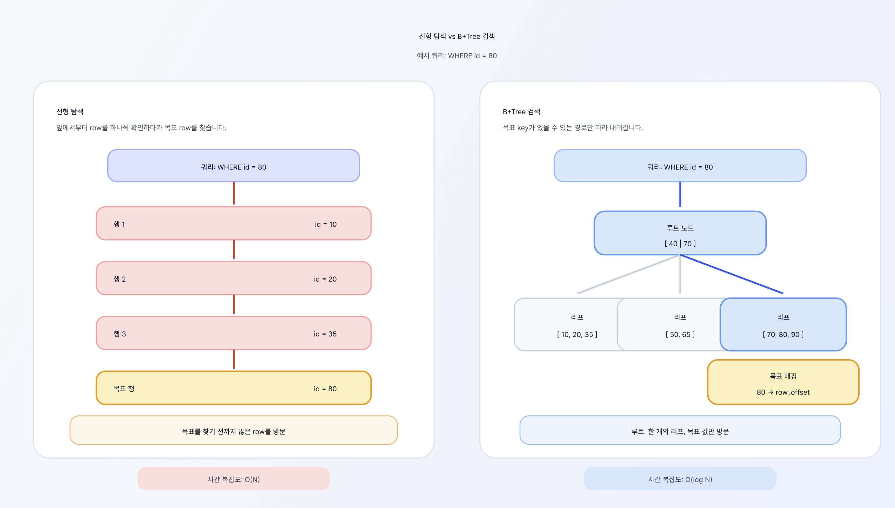
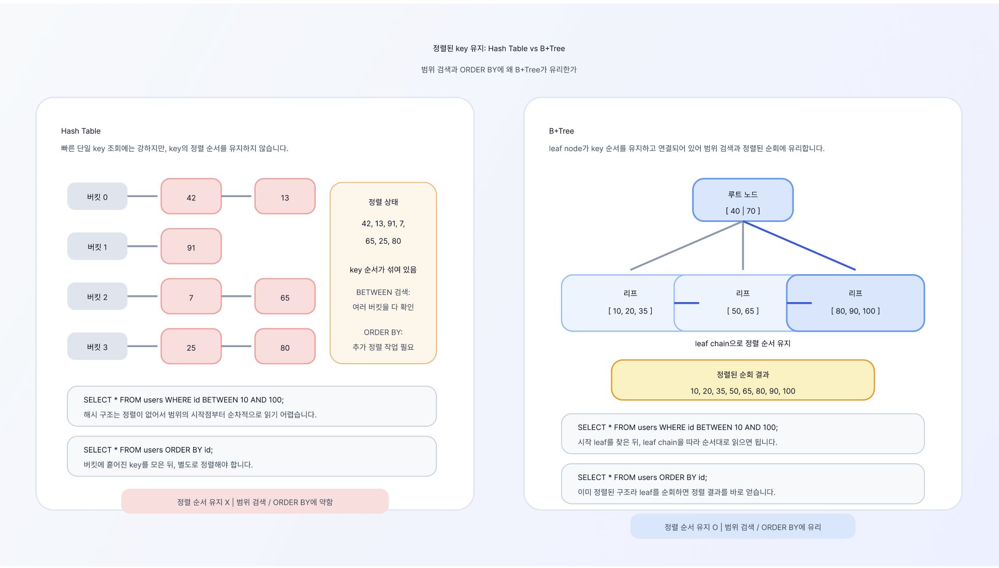
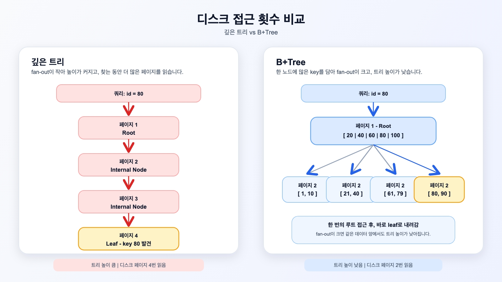
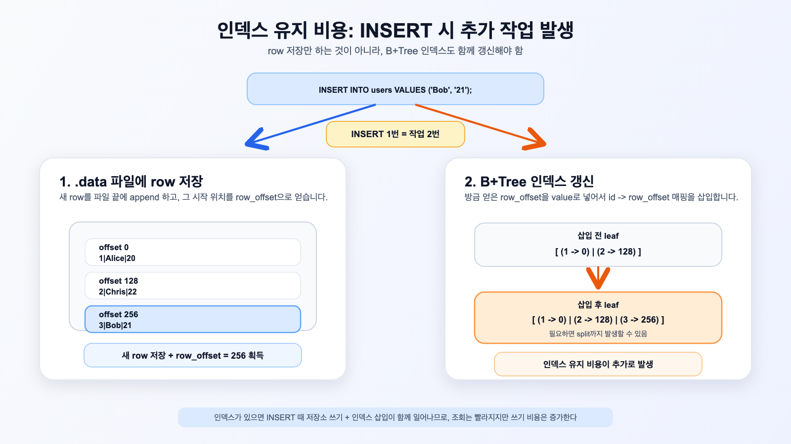
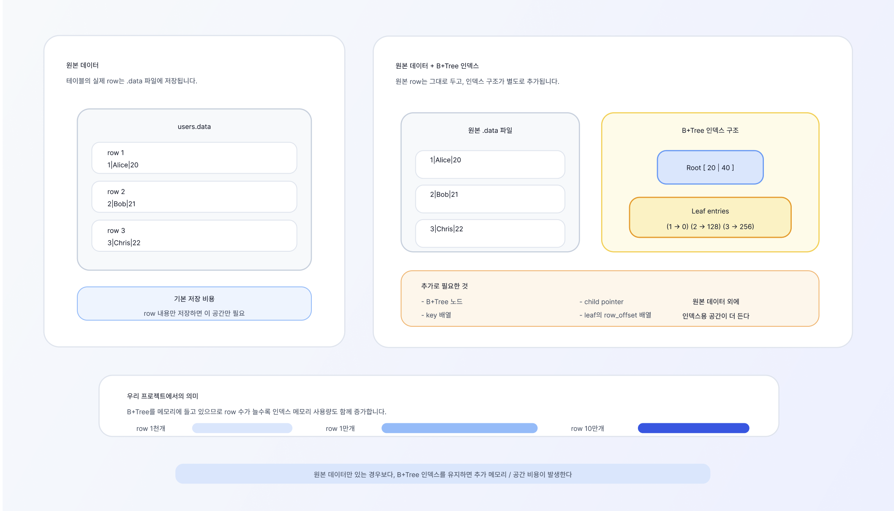

# B+Tree SQL Engine

## 전체 구조



## B+Tree의 장점

### 1. 검색 성능이 안정적이다


B+Tree는 전체 데이터를 처음부터 끝까지 확인하지 않고, 트리 구조를 따라 내려가며 key를 찾습니다.

```text
전체 스캔: O(N)
B+Tree 검색: O(log N)
```

B+Tree는 전체 데이터를 처음부터 끝까지 훑지 않고, root부터 leaf까지 트리 경로를 따라 key를 찾습니다.
그래서 데이터가 많아져도 검색 비용이 O(log N) 수준으로 유지됩니다.
특히 WHERE id = ? 같은 조건에서 선형 탐색보다 안정적인 조회 성능을 냅니다.

### 2. 정렬된 key를 유지한다



B+Tree는 key를 항상 정렬된 상태로 저장합니다.
그래서 특정 key 검색뿐 아니라 범위 검색이나 정렬된 조회에도 유리합니다.
예를 들어 BETWEEN같은 작업에 활용하기 좋습니다.
Hash Table은 단일 key 조회에는 빠를 수 있지만, key의 정렬 순서를 유지하지 않기 때문에 범위 검색이나 정렬에는 약합니다.

```sql
SELECT * FROM users WHERE id BETWEEN 10 AND 100;
SELECT * FROM users ORDER BY id;
```


### 3. 디스크 기반 DB에 잘 맞는다



```text
트리 높이가 낮음
-> 디스크 접근 횟수 감소
-> DB 인덱스에 적합
```

RAM은 디스크보다 훨씬 빠르기 때문에, RAM 기반 DB에서는 트리 높이를 줄이는 효과가 상대적으로 덜 크게 느껴질 수 있습니다.
반면 디스크 기반 DB는 한 번의 디스크 접근 비용이 크기 때문에, 페이지 접근 횟수를 줄이는 것이 성능에 직접적인 영향을 줍니다.
B+Tree는 노드 하나에 많은 key를 담아 트리 높이를 낮추므로, 느린 디스크 접근을 최소화해야 하는 디스크 기반 DB에 특히 잘 맞습니다.

## B+Tree의 한계

### 1. 인덱스 유지 비용이 있다



B+Tree 인덱스는 조회를 빠르게 해주지만, INSERT 때마다 원본 데이터 저장 외에 인덱스에도 id -> row_offset을 추가해야 합니다.
즉 읽기 성능을 얻는 대신, 쓰기 시 인덱스를 유지하는 추가 비용을 감수하는 구조입니다.

### 2. 노드 split 비용이 있다

B+Tree 노드가 가득 차면 split이 발생합니다.

```text
leaf node split
internal node split
parent key 갱신
root 변경 가능
```

B+Tree 노드가 가득 찬 상태에서 새 key를 넣으면 split이 발생합니다.
이때 key를 나누고, 새 노드를 만들고, 부모 노드에 separator key를 올려야 합니다.
따라서 대량 INSERT 상황에서는 split 비용이 누적될 수 있습니다.

### 3. 추가 메모리나 디스크 공간이 필요하다


B+Tree 인덱스는 원본 데이터와 별도로 key와 row 위치 정보를 저장합니다.
그래서 데이터 파일 외에 인덱스 노드, key 배열, child pointer 또는 row_offset 공간이 추가로 필요합니다.
조회 성능을 얻는 대신 저장 공간을 더 사용하는 구조입니다.

```text
원본 데이터
+ B+Tree 노드
+ key 배열
+ child pointer 또는 row_offset
```
